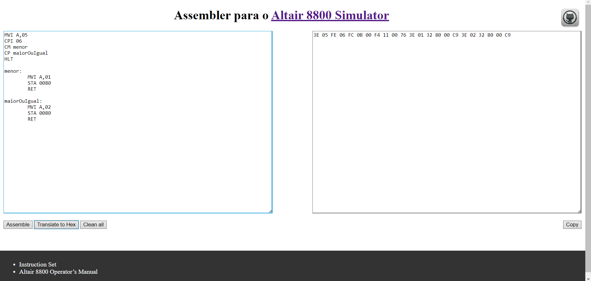
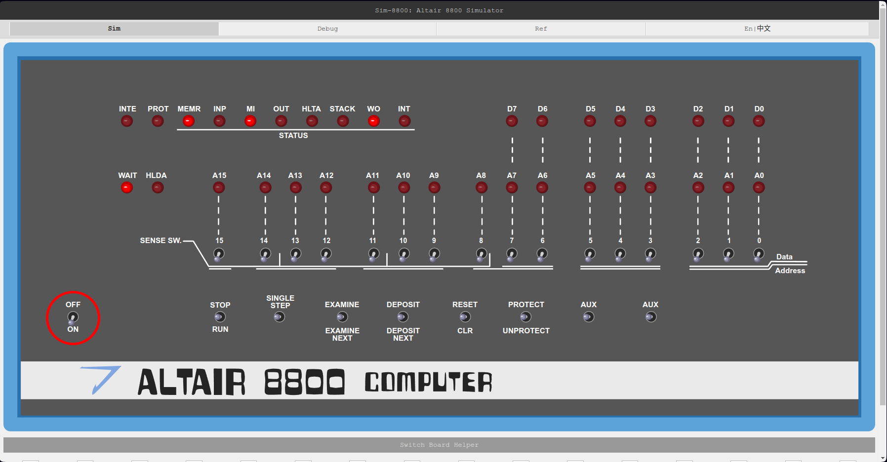
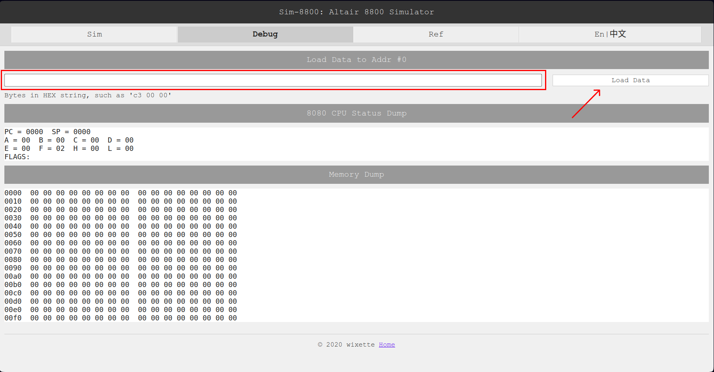
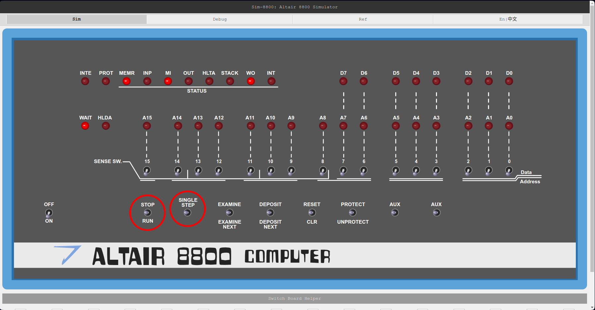

<h1 align="center">
	Assembler para o <a target="_blank" href="https://wixette.github.io/8800-simulator/">Altair 8800 Simulator</a>
</h1>

	

## Descrição

Este projeto consiste em um <a target="_blank" href="https://florindorian.github.io/assembler-altair8800/">Assembler web</a> para um simulador do Altair 8800 desenvolvido por <a href="https://github.com/wixette">Yonggang Wang</a>. O referido montador e todo o seu processo de construção foram concebidos, a princípio, como ferramentas para melhorar o entendimento de conceitos da disciplina de Arquitetura de Computadores, em especial aqueles relacionados à <strong>montagem</strong>, por meio da implementação deles em uma linguagem de alto nível. 

Vale ressaltar que o Altair 8800 foi o primeiro PC a obter sucesso no mercado, por volta de 1975, devido à sua relativa acessibilidade em comparação com os preços absurdos dos mainframes da época.

## Como usar

O Assembler possui uma "input-area" à esquerda, onde deve ser inserido o código Assembly, e uma "output-area" à direita, onde o resultado da tradução é exibido se o programa for escrito corretamente. Clicando no botão <strong>Assemble</strong>, a saída é gerada na base binária. Clicando no botão <strong>Translate to Hex</strong>, a saída é gerada na base hexadecimal. Este último caso é o que será mais útil, pois o simulador mencionado anteriormente só aceita esse tipo de código no carregamento das instruções na memória do PC Altair. Em seguida, copie o código gerado na "output-area".

Vá para o Altair 8800 Simulator e ligue-o clicando na chave indicada abaixo.

Feito isso, vá para a seção <strong>Debug</strong> na parte superior do simulador, cole o código copiado na caixa de texto destacada e clique no botão <strong>Load Data</strong>. Note que o Mapa de Memória agora tem alguns valores diferentes de "00" a partir do primeiro endereço, o que significa que as instruções foram carregadas na memória.

Volte à tela inicial do Simulador e clique em <strong>RUN</strong> para rodar o programa completo ou clique em <strong>SINGLE STEP</strong> para rodá-lo passo a passo.

## Observações
Durante os testes, constatou-se que o botão <strong>Copy</strong> não funciona como deveria nos navegadores Opera e Opera GX. No Chrome, no Edge e no Firefox o referido botão funciona normalmente.

## Links Úteis
<a target="_blank" href="https://florindorian.github.io/assembler-altair8800/">Altair 8800 Assembler</a> 
<a target="_blank" href="https://wixette.github.io/8800-simulator/">Altair 8800 Simulator</a> 
<a class="link-footer" target="_blank" href="http://dunfield.classiccmp.org//r/8080.txt">Instruction Set</a> 
<a class="link-footer" target="_blank" href="https://ubuntourist.codeberg.page/Altair-8800/">Altair 8800 Operator's Manual</a>